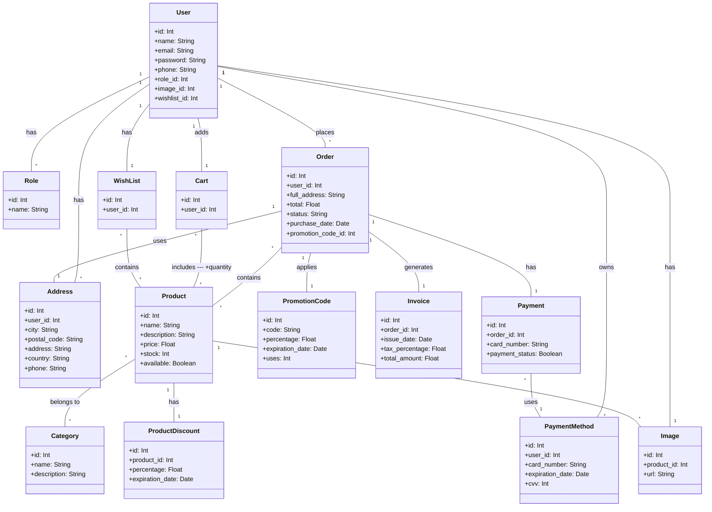

```mermaid
classDiagram
    class User {
        +id: Int
        +name: String
        +email: String
        +password: String
        +phone: String
        +role_id: Int
        +image_id: Int
        +wishlist_id: Int
    }

    class Role {
        +id: Int
        +name: String
    }

    class Address {
        +id: Int
        +user_id: Int
        +city: String
        +postal_code: String
        +address: String
        +country: String
        +phone: String
    }

    class Product {
        +id: Int
        +name: String
        +description: String
        +price: Float
        +stock: Int
        +available: Boolean
    }

    class Category {
        +id: Int
        +name: String
        +description: String
    }

    class PromotionCode {
        +id: Int
        +code: String
        +percentage: Float
        +expiration_date: Date
        +uses: Int
    }

    class ProductDiscount {
        +id: Int
        +product_id: Int
        +percentage: Float
        +expiration_date: Date
    }

    class Cart {
        +id: Int
        +user_id: Int
    }

    class Order {
        +id: Int
        +user_id: Int
        +full_address: String
        +total: Float
        +status: String
        +purchase_date: Date
        +promotion_code_id: Int
    }

    class Invoice {
        +id: Int
        +order_id: Int
        +issue_date: Date
        +tax_percentage: Float
        +total_amount: Float
    }

    class Payment {
        +id: Int
        +order_id: Int
        +card_number: String
        +payment_status: Boolean
    }

    class PaymentMethod {
        +id: Int
        +user_id: Int
        +card_number: String
        +expiration_date: Date
        +cvv: Int
    }

    class Image {
        +id: Int
        +product_id: Int
        +url: String
    }

    class WishList {
        +id: Int
        +user_id: Int
    }

    User "1" -- "*" Address : has
    User "1" -- "1" Cart : adds
    User "1" -- "*" Order : places
    User "1" -- "*" PaymentMethod : owns
    User "1" -- "*" Role : has
    User "1" -- "1" Image : has
    User "1" -- "1" WishList : has

    Order "1" -- "1" Address : uses
    Order "1" -- "1" Payment : has
    Order "1" -- "1" Invoice : generates
    Order "1" -- "1" PromotionCode : applies
    Order "*" -- "*" Product : contains

    Payment "*" -- "1" PaymentMethod : uses

    Cart "*" -- "*" Product : includes --- +quantity
    Product "*" -- "*" Category : belongs to
    Product "1" -- "1" ProductDiscount : has
    Product "1" -- "*" Image : has
    WishList "*" -- "*" Product : contains
```
