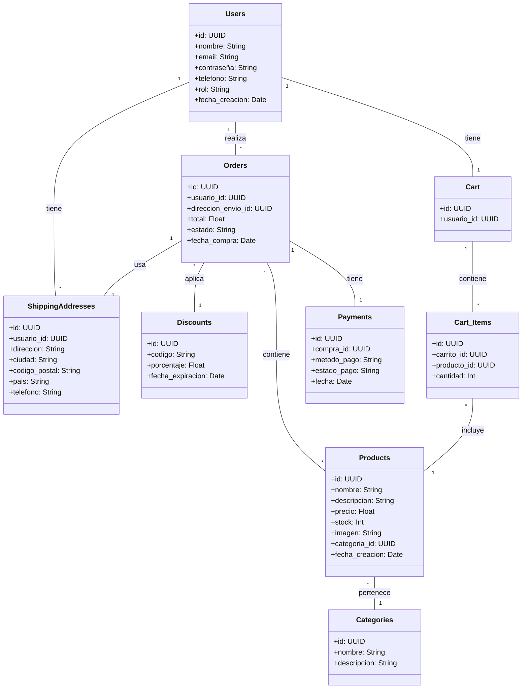

```mermaid
classDiagram
    class Users {
        +id: UUID
        +nombre: String
        +email: String
        +contraseña: String
        +telefono: String
        +rol: String
        +fecha_creacion: Date
    }
    
    class ShippingAddresses {
        +id: UUID
        +usuario_id: UUID
        +direccion: String
        +ciudad: String
        +codigo_postal: String
        +pais: String
        +telefono: String
    }
    
    class Products {
        +id: UUID
        +nombre: String
        +descripcion: String
        +precio: Float
        +stock: Int
        +imagen: String
        +categoria_id: UUID
        +fecha_creacion: Date
    }
    
    class Categories {
        +id: UUID
        +nombre: String
        +descripcion: String
    }
    
    class Discounts {
        +id: UUID
        +codigo: String
        +porcentaje: Float
        +fecha_expiracion: Date
    }
    
    class Cart {
        +id: UUID
        +usuario_id: UUID
    }
    
    class Cart_Items {
        +id: UUID
        +carrito_id: UUID
        +producto_id: UUID
        +cantidad: Int
    }
    
    class Orders {
        +id: UUID
        +usuario_id: UUID
        +direccion_envio_id: UUID
        +total: Float
        +estado: String
        +fecha_compra: Date
    }
    
    class Payments {
        +id: UUID
        +compra_id: UUID
        +metodo_pago: String
        +estado_pago: String
        +fecha: Date
    }
    
    Users "1" -- "*" ShippingAddresses : tiene
    Users "1" -- "1" Cart : tiene
    Users "1" -- "*" Orders : realiza
    Orders "1" -- "1" ShippingAddresses : usa
    Orders "1" -- "1" Payments : tiene
    Orders "1" -- "*" Products : contiene
    Cart "1" -- "*" Cart_Items : contiene
    Cart_Items "*" -- "1" Products : incluye
    Products "*" -- "1" Categories : pertenece
    Orders "*" -- "1" Discounts : aplica
```
